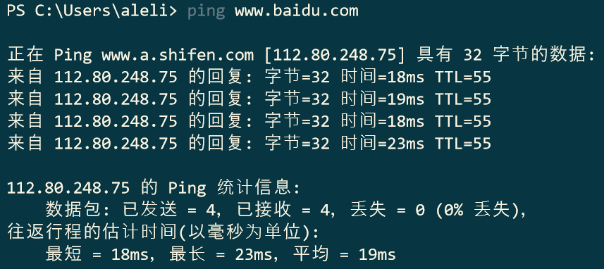
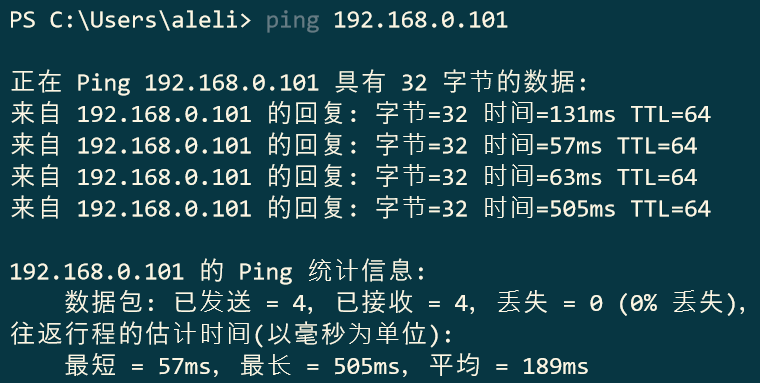
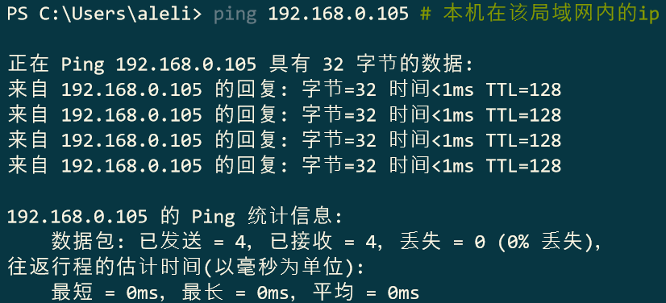
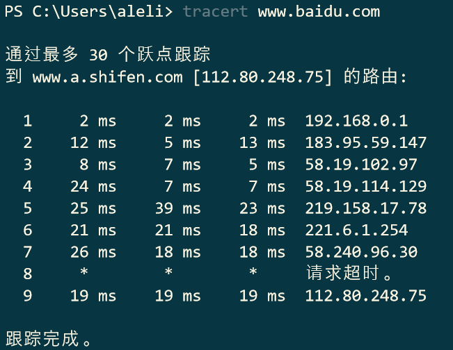
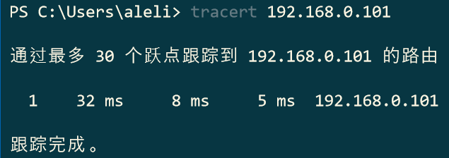

# DNAP-HOMEWORK-1

##### 2016301200123 尹邦国 17级软工四班

## ping

> ping是一种电脑网络工具，用来测试数据包能否通过IP协议到达特定主机。

#### ping 百度的服务器

在PowerShell执行如下指令：

```powershell
ping www.baidu.com
```

得：



可见本机与百度服务器网络连接状况较好、延迟较低。

#### ping 局域网内的另一台设备

在PowerShell执行如下指令：

```powershell
ping 192.168.0.101
```

得：



比较让人意外的是，在百度服务器和本机之间的往返行程的估计时间竟然短于局域网内的另一台机器与本机之间的。

#### ping 本机

在PowerShell执行如下指令：

```powershell
ping 192.168.0.105 # 本机在该局域网内的ip
```

得：



本次结果在意料之中，延迟远小于前两次实验。

## tracert

> tracert是诊断网络问题时常用的工具，它可以定位从源主机到目标主机之间经过了哪些路由器，以及到达各个路由器的耗时。

#### tracert 百度的服务器

在PowerShell执行如下指令：

```powershell
tracert www.baidu.com
```

得：



#### tracert 局域网内的另一台设备

在PowerShell执行如下指令：

```powershell
tracert 192.168.0.101
```

得：



显然，从本地到局域网内的另一台设备所经过的节点少于从本机到百度服务器的。