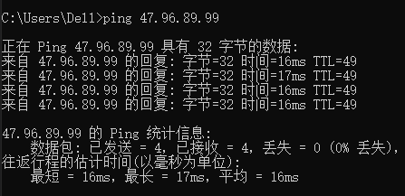
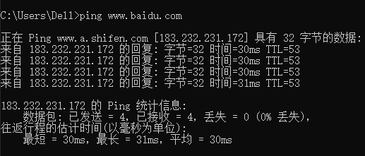
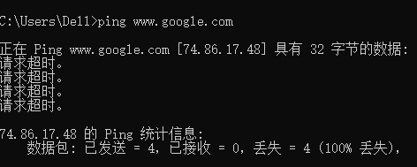
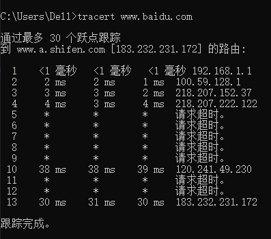

## 第一次作业

* * *

### ping另外一台计算机

> ping用于确定本地主机是否能与另一台主机成功交换(发送与接收)数据包，再根据返回的信息，就可以推断TCP/IP参数是否设置正确，以及运行是否正常、网络是否通畅等。

* ping一台在阿里云上的计算机

    

* ping百度主页

    

* ping谷歌主页

    

* * *

### tracert一个服务器

> Tracert（跟踪路由）是路由跟踪实用程序，用于确定 IP 数据包访问目标所采取的路径。Tracert 命令用 IP 生存时间 (TTL) 字段和 ICMP 错误消息来确定从一个主机到网络上其他主机的路由。

* tracert百度服务器

    

* tracert谷歌服务器

    
