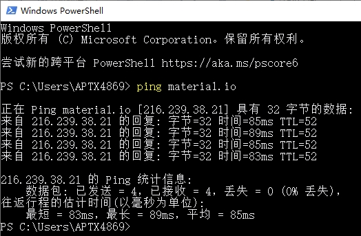
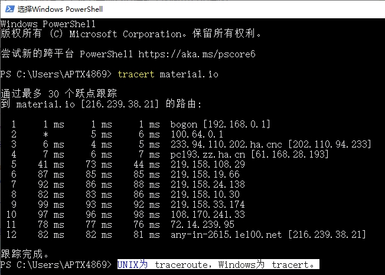

# 1. ping另一台计算机
``` ping material.io ```



# 2. tracert服务器
``` tracert material.io ```

UNIX为 traceroute， Windows为tracert。



> 参考文献：[ping, tracert, traceroute, netstat命令详解](https://blog.csdn.net/ithomer/article/details/5054807)
