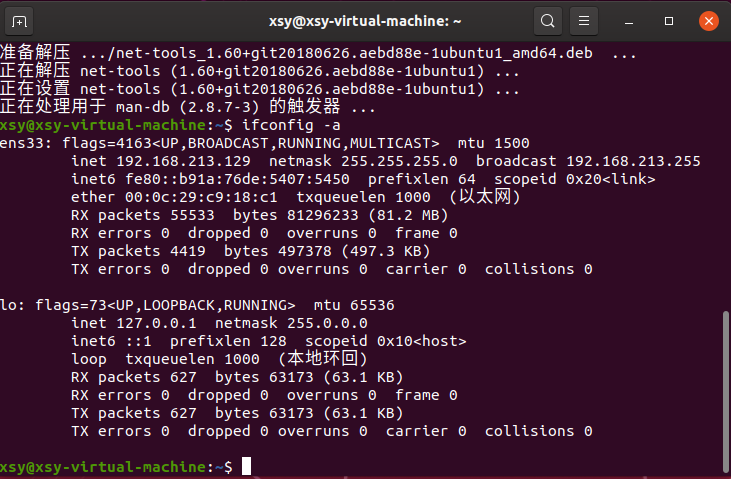
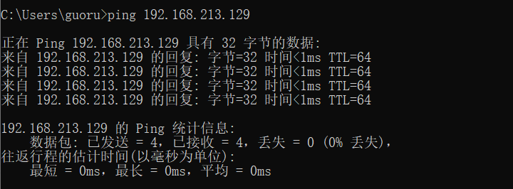
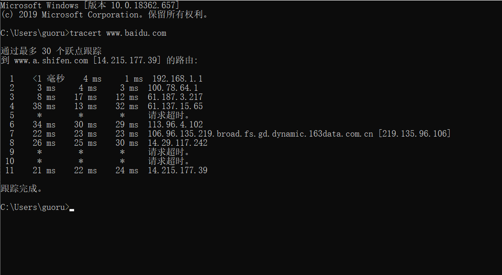

[toc]


# 一、ping另外一台计算机


### 1.1 ping 原理

[参考链接](https://www.cnblogs.com/whitemouseV2-0/p/10839141.html)

> 本机创建一个数据包发送给（ping对象）目标IP，目标接收后返回给本机一个完全一样的数据包。常用于检查本地与目标服务器之间的网络是否畅通。


### 1.2 ping 操作步骤（ping本机与虚拟机）

1. 查询虚拟机的ip地址

   使用命令得到虚拟机ip（**192.168.213.129**）：

   ```bash
   ifconfig -a
   ```

   

2. 在本机ping+虚拟机ip：

   ```bash
   ping 192.168.213.129
   ```
   
   


# 二、tracert 一个服务器


### 1.1 tracert原理

[tracert百度百科]([https://baike.baidu.com/item/%E8%B7%9F%E8%B8%AA%E8%B7%AF%E7%94%B1/8971154?fromtitle=tracert&fromid=7578188&fr=aladdin](https://baike.baidu.com/item/跟踪路由/8971154?fromtitle=tracert&fromid=7578188&fr=aladdin))

> 通过向目标发送不同IP生存时间 (TTL) 值的“[Internet](https://baike.baidu.com/item/Internet)控制消息协议 ([ICMP](https://baike.baidu.com/item/ICMP))”回应[数据包](https://baike.baidu.com/item/数据包)，Tracert诊断程序确定到目标所采取的路由。要求路径上的每个[路由器](https://baike.baidu.com/item/路由器)在转发数据包之前至少将数据包上的 TTL 递减 1。数据包上的 TTL 减为 0 时，路由器应该将“ICMP 已超时”的消息发回源系统。


### 1.2 tracert百度服务器

```bash
tracert www.baidu.com
```

