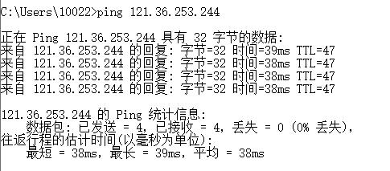
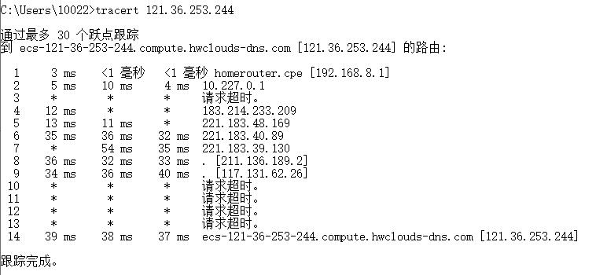

## 分布式与网络课程作业一

### ping：
这里我 ping 的是云服务器的公网 IP，一开始无法 ping 通，后来发现原因是云服务器的 ICMP 端口并没有打开。
ping 是基于 ICMP 协议工作的，对应 ICMP 的查询报文类型，是一种主动请求，并且获得主动应答的 ICMP 协议，主要是用来查看到目的地址的时延和丢包情况：

### tracert:
tracert 也是基于 ICMP 协议工作的，对应 ICMP 的差错报文类型。它会使用 ICMP 的规则，故意制造一些能够产生错误的场景。例如，故意设置特殊的 TTL，来追踪去往目的地时沿途经过的路由器：

 

tracert 的参数指向云服务器的公网 IP，它会发送一个 UDP 数据包。将 TTL 设置成 1，也就是说一旦遇到一个路由器或者一个关卡，就表示它“牺牲”了。接下来，将 TTL 设置为 2。如此反复，直到到达目的主机。这样，tracert 就拿到了所有的路由器 IP。当然，有的路由器防止自己的IP泄露，压根不会回这个 ICMP。截图中有些 hop 出现请求超时就是因为这个原因。
