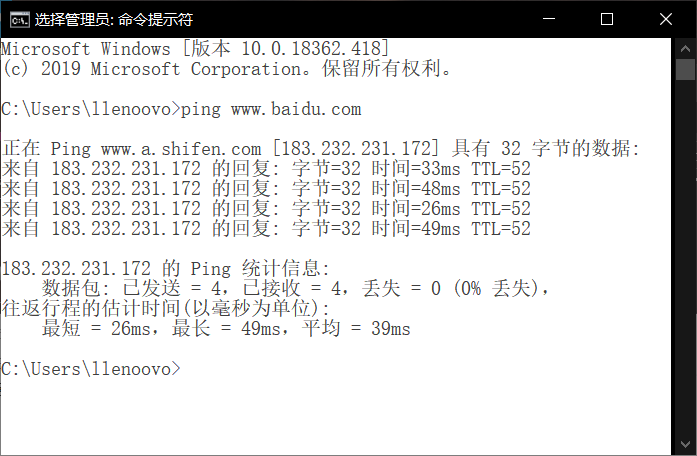
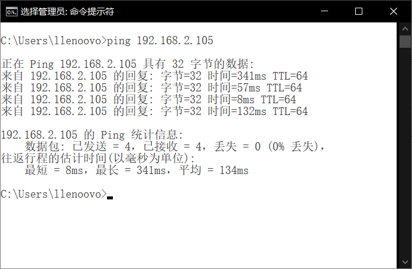
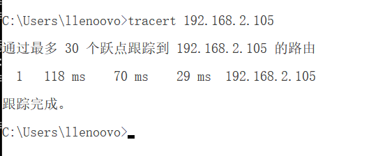
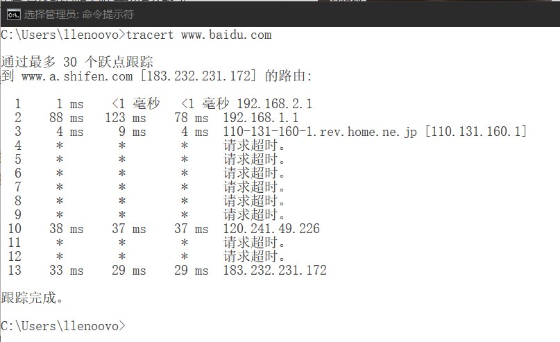

# 第一次作业

​			软工五班 曾志昊 2017302580214

## Homework 1  - ping

>- **首先尝试 ping 百度**
>
> ```
> ping www.baidu.com
> ```
>
> 结果如下：
>
>
>
>​	结果中显示正在Ping www.a.shifen.com，与我们输入的www.baidu.com 不同，实际上前者是后者的别名。
>
>- **尝试ping的手机**
>
> 首先要确保手机与电脑连接在同一wifi下，查看手机ip：**192.168.2.105**
>
> ```
> ping 192.168.2.105
> ```
>
> 结果如下：
>
>

## Homewor2 - tracert

>- **首先尝试tracet百度**
>
>  ```
>  tracert www.baidu.com
>  ```
>
>  结果如下：
>
> 
>
> 
>
>  在ping百度时可以通，但是在tracert中却有多次请求超时，原因是这些节点为了防止核心设备的IP泄露，做了禁止跟踪。
>
>- 尝试tracet手机
>
>  手机与电脑连接同一wifi，IP为：**192.168.2.105**
>
>  ```
>  tracert 192.168.2.105
>  ```
>
>  
>
>  