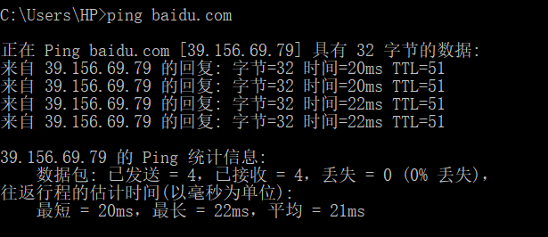
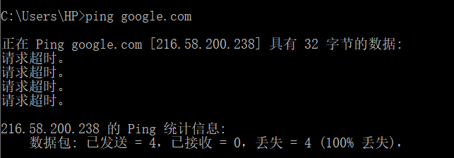
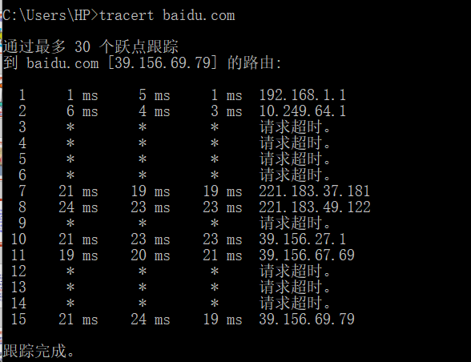
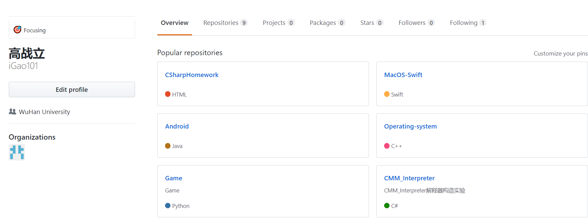

<h1>Homework1</h1>

## 1. Ping

​		Ping（Packet Internet Groper），即因特网包探索器，用来测试主机之间的网络连通性，其通过数据包的发送和接收推断TCP/IP参数设置设否正确，以及运行是否正常、网络是否通畅。Ping命令通常会执行以下操作：

* 通过将ICMP回显数据包发送到计算机并侦听回显回复数据包来验证与一台或多台远程计算机的连接；

* 每个发送的数据包最多等待一秒；

* 打印已传输和接受的数据包数。

​        需要注意的是，ping成功并不一定就代表TCP/IP配置正确，有可能还要执行大量的本地主机与远程主机的数据包交换，才能确信TCP/IP配置的正确性。

​		此处以百度为例进行ping命令测试，从以下结果可以看出百度访问正常。

</img>

1.1 ping百度测试

​		在不使用翻墙软件的情况下，当我们试图ping一些国外网址时，大概率会出现ping不通的情况。

</img>

1.2 ping谷歌测试

## 2. Tracert

​		Tracert是路由跟踪实用程序，用于确定IP数据包访问目标所采取的路径，其通过IP生存时间（TTL）字段和ICMP错误消息来确定从一个主机到网络上其他主机的路由。以下以百度为例进行测试，输出数据中出现“请求超时”字样的原因是该路由接口禁用了对tracert数据包的响应。

</img>

2.1 tracert百度测试

## 3. Github

​		Github注册信息如下，公司栏设置为武汉大学且wireshark资源已下载完毕。

</img>

3.1 github信息

