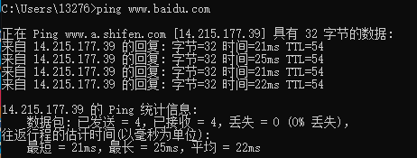
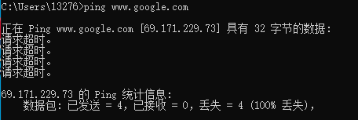
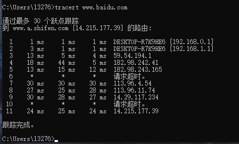

### 1、ping另外一台计算机：

​	ping用于确定本地主机是否能与另一台主机成功交换(发送与接收)数据包，再根据返回的信息，就可以推断[TCP/IP](https://baike.baidu.com/item/TCP%2FIP/214077)参数是否设置正确，以及运行是否正常、网络是否通畅等。

#### 	①、百度

#### 	②、google

### 2、tracert 一个服务器：以百度为例；

Tracert（跟踪路由）是[路由跟踪](https://baike.baidu.com/item/路由跟踪/8935428)实用程序，用于确定 IP 数据包访问目标所采取的路径。Tracert 命令用 IP 生存时间 (TTL) 字段和 ICMP 错误消息来确定从一个[主机](https://baike.baidu.com/item/主机/455151)到网络上其他主机的路由。

