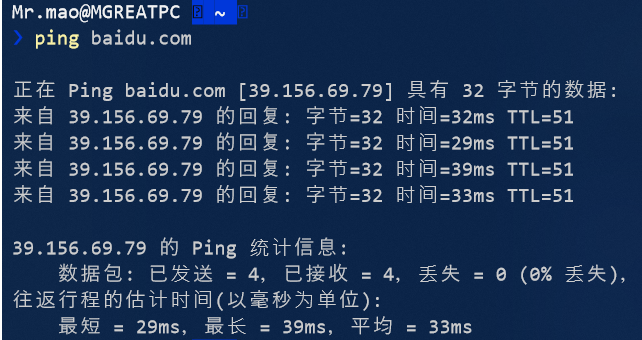
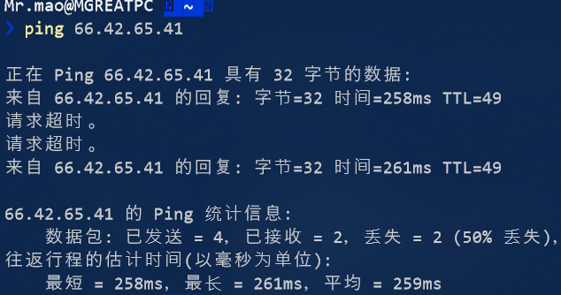
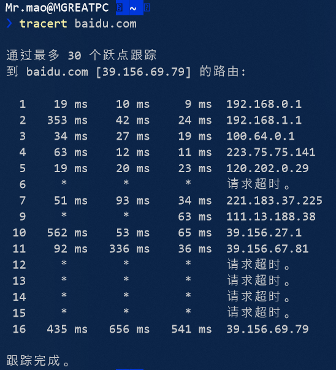

## ping另一台计算机

> PING （Packet Internet Groper），因特网包探索器，用于测试网络连接量的程序 。Ping是工作在 TCP/IP网络体系结构中应用层的一个服务命令， 主要是向特定的目的主机发送ICMP（Internet Control Message Protocol 因特网报文控制协议）Echo 请求报文，测试目的站是否可达及了解其有关状态 。

### 用法

``` bash
❯ ping

用法: ping [-t] [-a] [-n count] [-l size] [-f] [-i TTL] [-v TOS]
            [-r count] [-s count] [[-j host-list] | [-k host-list]]
            [-w timeout] [-R] [-S srcaddr] [-c compartment] [-p]
            [-4] [-6] target_name

选项:
    -t             Ping 指定的主机，直到停止。
                   若要查看统计信息并继续操作，请键入 Ctrl+Break；
                   若要停止，请键入 Ctrl+C。
    -a             将地址解析为主机名。
    -n count       要发送的回显请求数。
    -l size        发送缓冲区大小。
    -f             在数据包中设置“不分段”标记(仅适用于 IPv4)。
    -i TTL         生存时间。
    -v TOS         服务类型(仅适用于 IPv4。该设置已被弃用，
                   对 IP 标头中的服务类型字段没有任何
                   影响)。
    -r count       记录计数跃点的路由(仅适用于 IPv4)。
    -s count       计数跃点的时间戳(仅适用于 IPv4)。
    -j host-list   与主机列表一起使用的松散源路由(仅适用于 IPv4)。
    -k host-list    与主机列表一起使用的严格源路由(仅适用于 IPv4)。
    -w timeout     等待每次回复的超时时间(毫秒)。
    -R             同样使用路由标头测试反向路由(仅适用于 IPv6)。
                   根据 RFC 5095，已弃用此路由标头。
                   如果使用此标头，某些系统可能丢弃
                   回显请求。
    -S srcaddr     要使用的源地址。
    -c compartment 路由隔离舱标识符。
    -p             Ping Hyper-V 网络虚拟化提供程序地址。
    -4             强制使用 IPv4。
    -6             强制使用 IPv6。
```


### 示例

- ping百度网站



- ping位于LA的vps服务器



从以上两次ping可以看出，位于国内的服务器网络状态较好，位于国外的就不太行

------


## tracert一个服务器

> tracert也被称为Windows路由跟踪实用程序，在命令提示符（cmd）中使用tracert命令可以用于确定IP数据包访问目标时所选择的路径。

### 用法

``` bash
❯ tracert

用法: tracert [-d] [-h maximum_hops] [-j host-list] [-w timeout]
               [-R] [-S srcaddr] [-4] [-6] target_name

选项:
    -d                 不将地址解析成主机名。
    -h maximum_hops    搜索目标的最大跃点数。
    -j host-list       与主机列表一起的松散源路由(仅适用于 IPv4)。
    -w timeout         等待每个回复的超时时间(以毫秒为单位)。
    -R                 跟踪往返行程路径(仅适用于 IPv6)。
    -S srcaddr         要使用的源地址(仅适用于 IPv6)。
    -4                 强制使用 IPv4。
    -6                 强制使用 IPv6。
```

### 示例

- tracert本地到百度服务器的路径



从左到右的5条信息分别代表了“生存时间”（每途经一个路由器结点自增1）、“三次发送的ICMP包返回时间”（共计3个，单位为毫秒ms）和“途经路由器的IP地址”（如果有主机名，还会包含主机名）。